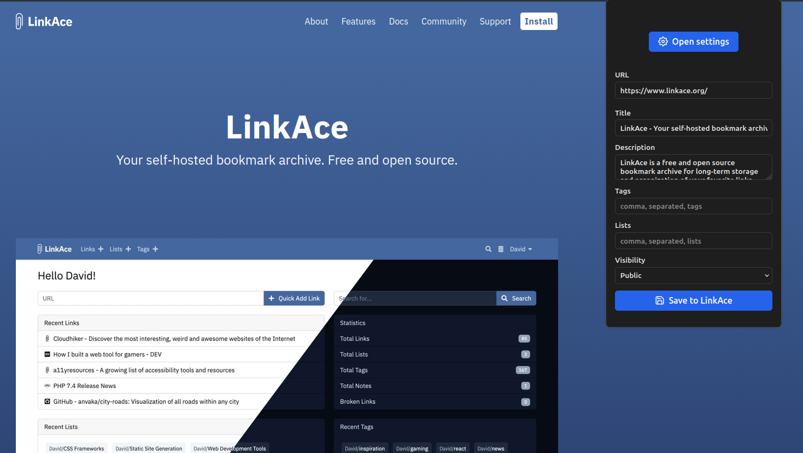
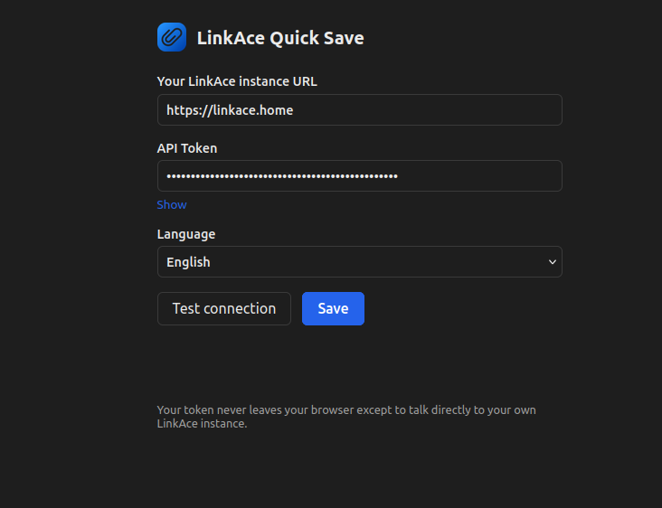

# LinkAce Quick Save

A Firefox extension to save the current tab to your self-hosted
[LinkAce](https://www.linkace.org/) instance in one click — pick tags and
lists without leaving the page, no bookmarks toolbar needed.

  

## Status

Core save flow works end to end: popup, options, and REST API client are
all in place. Not yet published — see [Roadmap](#roadmap).

## Why an API token, not the bookmarklet flow?

LinkAce ships an official bookmarklet that opens
`{instance}/links/create?url=...` using your existing browser session —
no token required. This extension instead uses LinkAce's versioned REST
API with a personal API token, because it lets the popup pre-fill tags
and lists before saving, which the bookmarklet's URL-only flow can't do.
The token is stored locally (`browser.storage.local`) and is only ever
sent to the instance URL you configure.

## Features

- Save the current tab to LinkAce via its REST API (`/api/v2/links`),
  with a keyboard shortcut (`Alt+Shift+L` by default)
- Title and description are pre-filled automatically — description comes
  from the page's own `<meta name="description">` (or `og:description`)
- Assign existing tags and lists at save time, picked from an
  autocomplete dropdown that only loads from the API once you focus the
  field, not on every popup open
- **Duplicate detection:** if the current page is already saved, the
  popup tells you and links straight to the existing entry
- **Update in place:** saving an already-saved URL pre-fills its current
  title, description, tags, lists, and visibility, and switches to
  updating that link (`PATCH`) instead of creating a duplicate
- Settings page for instance URL, API token, and language
- Interface available in English and Spanish, independent of the
  browser's own language

## Screenshots

## Requirements

**Your LinkAce instance must be served over HTTPS.** This isn't optional
or extension-specific — modern Firefox actively blocks or silently
rewrites plain `http://` requests from extensions to arbitrary hosts (see
[Troubleshooting](#troubleshooting)). A self-signed certificate is fine;
plain HTTP is not supported.

## Installation

**Coming soon on addons.mozilla.org** — the store link will go here once
published. Trying it before then requires loading it as a temporary
add-on; see [Development](#development).

## Configuration

Once installed, click the LinkAce Quick Save icon → **Settings** (or
right-click the icon → Options):

1. **Instance URL** — your LinkAce instance, e.g.
   `https://linkace.example.com`. Must be HTTPS — see
   [Requirements](#requirements).
2. **API Token** — generate one in LinkAce under **Profile → API
   Tokens**, then paste it here.
3. **Language** — English or Spanish, independent of your browser's
   language.
4. Click **Test connection** to confirm, then **Save**.

You'll be asked to grant the extension permission to access your
instance's domain the first time — this is a one-time native Firefox
prompt.

## Troubleshooting

Running into connection errors, especially with a self-hosted or local
network instance? See [docs/TROUBLESHOOTING.md](docs/TROUBLESHOOTING.md).

## Development

1. Clone this repo.
2. In Firefox, open `about:debugging#/runtime/this-firefox`.
3. Click **Load Temporary Add-on** and select `manifest.json`.
4. Follow [Configuration](#configuration) above to set it up.

## Roadmap

- [ ] Background/service worker if needed for optional host permissions
- [ ] Publish to addons.mozilla.org (add signing/submission steps to
      Installation once this happens)

## Contributing

Issues and PRs welcome.

## License

[GPL-3.0](LICENSE).
